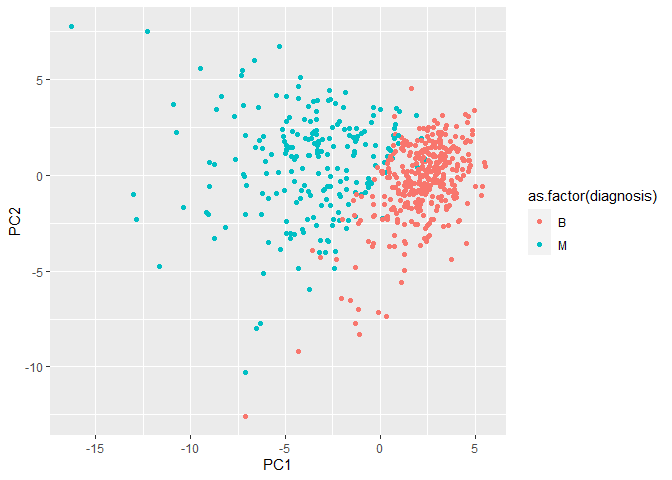
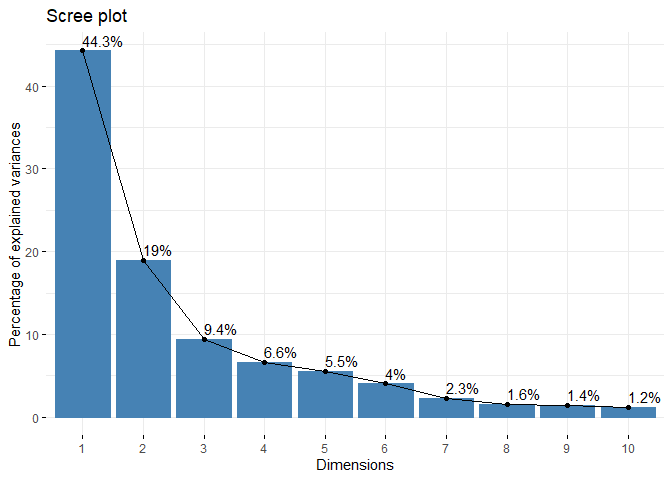
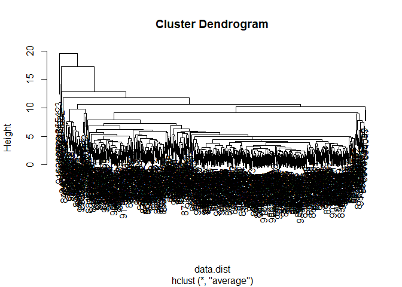
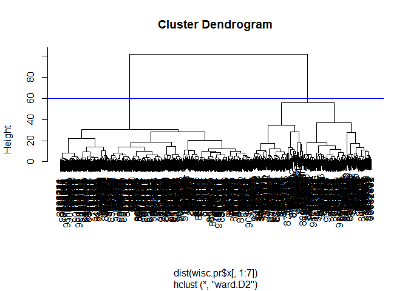
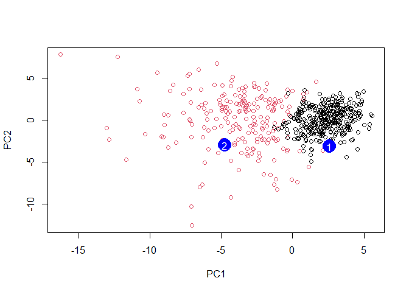

Lab9_git
================

``` r
# Save your input data file into your Project directory
fna.data <- "WisconsinCancer.csv"

wisc.df <- read.csv("WisconsinCancer.csv", row.names=1)
wisc.data <- wisc.df[,-1]
diagnosis <- wisc.df$diagnosis
```

> Q1. How many observations are in this data set?

There are 569 observations in this dataset.

``` r
nrow(wisc.data)
```

    ## [1] 569

> Q2: How many of the observations have a malignant diagnosis?

There are 212 malignant diagnosis cases.

``` r
table(diagnosis)
```

    ## diagnosis
    ##   B   M 
    ## 357 212

``` r
#table() function returns the number of Bs and Ms in the diagnosis vector.
```

> Q3: How many variables/features in the data are suffixed with \_mean?

10 variable names in the data are suffixed with \_mean.

``` r
length(grep("_mean$",colnames(wisc.df)))
```

    ## [1] 10

``` r
# just want to grep on the column names of this table
```

#2. PCA Analysis: # 1). Performing PCA Conduct a PCA analysis using the
scale=TRUE argument, in this case, as the columns data are on different
scales.

``` r
# Check column means and standard deviations
colMeans(wisc.data)
```

    ##             radius_mean            texture_mean          perimeter_mean 
    ##            1.412729e+01            1.928965e+01            9.196903e+01 
    ##               area_mean         smoothness_mean        compactness_mean 
    ##            6.548891e+02            9.636028e-02            1.043410e-01 
    ##          concavity_mean     concave.points_mean           symmetry_mean 
    ##            8.879932e-02            4.891915e-02            1.811619e-01 
    ##  fractal_dimension_mean               radius_se              texture_se 
    ##            6.279761e-02            4.051721e-01            1.216853e+00 
    ##            perimeter_se                 area_se           smoothness_se 
    ##            2.866059e+00            4.033708e+01            7.040979e-03 
    ##          compactness_se            concavity_se       concave.points_se 
    ##            2.547814e-02            3.189372e-02            1.179614e-02 
    ##             symmetry_se    fractal_dimension_se            radius_worst 
    ##            2.054230e-02            3.794904e-03            1.626919e+01 
    ##           texture_worst         perimeter_worst              area_worst 
    ##            2.567722e+01            1.072612e+02            8.805831e+02 
    ##        smoothness_worst       compactness_worst         concavity_worst 
    ##            1.323686e-01            2.542650e-01            2.721885e-01 
    ##    concave.points_worst          symmetry_worst fractal_dimension_worst 
    ##            1.146062e-01            2.900756e-01            8.394582e-02

``` r
apply(wisc.data,2,sd)
```

    ##             radius_mean            texture_mean          perimeter_mean 
    ##            3.524049e+00            4.301036e+00            2.429898e+01 
    ##               area_mean         smoothness_mean        compactness_mean 
    ##            3.519141e+02            1.406413e-02            5.281276e-02 
    ##          concavity_mean     concave.points_mean           symmetry_mean 
    ##            7.971981e-02            3.880284e-02            2.741428e-02 
    ##  fractal_dimension_mean               radius_se              texture_se 
    ##            7.060363e-03            2.773127e-01            5.516484e-01 
    ##            perimeter_se                 area_se           smoothness_se 
    ##            2.021855e+00            4.549101e+01            3.002518e-03 
    ##          compactness_se            concavity_se       concave.points_se 
    ##            1.790818e-02            3.018606e-02            6.170285e-03 
    ##             symmetry_se    fractal_dimension_se            radius_worst 
    ##            8.266372e-03            2.646071e-03            4.833242e+00 
    ##           texture_worst         perimeter_worst              area_worst 
    ##            6.146258e+00            3.360254e+01            5.693570e+02 
    ##        smoothness_worst       compactness_worst         concavity_worst 
    ##            2.283243e-02            1.573365e-01            2.086243e-01 
    ##    concave.points_worst          symmetry_worst fractal_dimension_worst 
    ##            6.573234e-02            6.186747e-02            1.806127e-02

``` r
# Perform PCA on wisc.data by completing the following code
wisc.pr <- prcomp( wisc.data, scale=TRUE )
```

``` r
# Look at summary of results
summary(wisc.pr)
```

    ## Importance of components:
    ##                           PC1    PC2     PC3     PC4     PC5     PC6     PC7
    ## Standard deviation     3.6444 2.3857 1.67867 1.40735 1.28403 1.09880 0.82172
    ## Proportion of Variance 0.4427 0.1897 0.09393 0.06602 0.05496 0.04025 0.02251
    ## Cumulative Proportion  0.4427 0.6324 0.72636 0.79239 0.84734 0.88759 0.91010
    ##                            PC8    PC9    PC10   PC11    PC12    PC13    PC14
    ## Standard deviation     0.69037 0.6457 0.59219 0.5421 0.51104 0.49128 0.39624
    ## Proportion of Variance 0.01589 0.0139 0.01169 0.0098 0.00871 0.00805 0.00523
    ## Cumulative Proportion  0.92598 0.9399 0.95157 0.9614 0.97007 0.97812 0.98335
    ##                           PC15    PC16    PC17    PC18    PC19    PC20   PC21
    ## Standard deviation     0.30681 0.28260 0.24372 0.22939 0.22244 0.17652 0.1731
    ## Proportion of Variance 0.00314 0.00266 0.00198 0.00175 0.00165 0.00104 0.0010
    ## Cumulative Proportion  0.98649 0.98915 0.99113 0.99288 0.99453 0.99557 0.9966
    ##                           PC22    PC23   PC24    PC25    PC26    PC27    PC28
    ## Standard deviation     0.16565 0.15602 0.1344 0.12442 0.09043 0.08307 0.03987
    ## Proportion of Variance 0.00091 0.00081 0.0006 0.00052 0.00027 0.00023 0.00005
    ## Cumulative Proportion  0.99749 0.99830 0.9989 0.99942 0.99969 0.99992 0.99997
    ##                           PC29    PC30
    ## Standard deviation     0.02736 0.01153
    ## Proportion of Variance 0.00002 0.00000
    ## Cumulative Proportion  1.00000 1.00000

> Q4. From your results, what proportion of the original variance is
> captured by the first principal components (PC1)?

44.27% variance is captured by the first principal components.

> Q5. How many principal components (PCs) are required to describe at
> least 70% of the original variance in the data?

3 principal components are required to describe at least 70% of the data
variance.

> Q6. How many principal components (PCs) are required to describe at
> least 90% of the original variance in the data?

7 components are required to describe at least 90% of the original
variance in the data.

# 2). Interpreting the PCA analysis results:

We are after the cored plot, which is known as Biplot.

> Q7. What stands out to you about this plot? Is it easy or difficult to
> understand? Why?

It’s messy and hard to understand, because the data is not compressed
and it tries to show too much information.

``` r
biplot(wisc.pr)
```

<!-- -->

To make this plot ourselves, we need to access the PCA scores data.

``` r
# Scatter plot observations by components 1 and 2
#$x is the 
plot( wisc.pr$x[,1:2] , col = as.factor(diagnosis), 
     xlab = "PC1", ylab = "PC2")
```

<!-- -->

> Q8. Generate a similar plot for principal components 1 and 3. What do
> you notice about these plots?

These new plots’ data dots usually span the diagonal line in the graph
and two clusters of data points show up, with different centers,
indicating the benign and malignant cells.

Since the PC1 component remains the same, the scatter pattern of the
dots are similar in these two graphs, but the scales of the y axis are
different in these two graphs, indicating different relationships with
PC1 and PC2.

``` r
# Repeat for components 1 and 3
plot(wisc.pr$x[, 1], wisc.pr$x[, 3], col = as.factor(diagnosis), 
     xlab = "PC1", ylab = "PC3")
```

<!-- -->

``` r
# Create a data.frame for ggplot
df <- as.data.frame(wisc.pr$x)
df$diagnosis <- diagnosis

# Load the ggplot2 package
library(ggplot2)

# Make a scatter plot colored by diagnosis
ggplot(df) + 
  aes(PC1, PC2, col=as.factor(diagnosis)) + 
  geom_point()
```

<!-- -->

# 3). Variance explained

``` r
# Calculate variance of each component
pr.var <- wisc.pr$sdev^2
head(pr.var)
```

    ## [1] 13.281608  5.691355  2.817949  1.980640  1.648731  1.207357

``` r
tot.var<-sum(pr.var)
# Variance explained by each principal component: pve
pve <- pr.var/ tot.var

# Plot variance explained for each principal component
plot(pve, xlab = "Principal Component", 
     ylab = "Proportion of Variance Explained", 
     ylim = c(0, 1), type = "o")
```

<!-- -->

``` r
# Alternative scree plot of the same data, note data driven y-axis
barplot(pve, ylab = "Precent of Variance Explained",
     names.arg=paste0("PC",1:length(pve)), las=2, axes = FALSE)
axis(2, at=pve, labels=round(pve,2)*100 )
```

<!-- -->

``` r
## ggplot based graph
#install.packages("factoextra")
library(factoextra)
```

    ## Welcome! Want to learn more? See two factoextra-related books at https://goo.gl/ve3WBa

``` r
fviz_eig(wisc.pr, addlabels = TRUE)
```

<!-- -->

# 4). Communicating PCA results

> Q9. For the first principal component, what is the component of the
> loading vector (i.e. wisc.pr$rotation\[,1\]) for the feature
> concave.points_mean?

for pC1. the component of the loading vector for concave.points_mean is
-0.2608.

``` r
wisc.pr$rotation[,1]
```

    ##             radius_mean            texture_mean          perimeter_mean 
    ##             -0.21890244             -0.10372458             -0.22753729 
    ##               area_mean         smoothness_mean        compactness_mean 
    ##             -0.22099499             -0.14258969             -0.23928535 
    ##          concavity_mean     concave.points_mean           symmetry_mean 
    ##             -0.25840048             -0.26085376             -0.13816696 
    ##  fractal_dimension_mean               radius_se              texture_se 
    ##             -0.06436335             -0.20597878             -0.01742803 
    ##            perimeter_se                 area_se           smoothness_se 
    ##             -0.21132592             -0.20286964             -0.01453145 
    ##          compactness_se            concavity_se       concave.points_se 
    ##             -0.17039345             -0.15358979             -0.18341740 
    ##             symmetry_se    fractal_dimension_se            radius_worst 
    ##             -0.04249842             -0.10256832             -0.22799663 
    ##           texture_worst         perimeter_worst              area_worst 
    ##             -0.10446933             -0.23663968             -0.22487053 
    ##        smoothness_worst       compactness_worst         concavity_worst 
    ##             -0.12795256             -0.21009588             -0.22876753 
    ##    concave.points_worst          symmetry_worst fractal_dimension_worst 
    ##             -0.25088597             -0.12290456             -0.13178394

``` r
pc1.concave_mean<-wisc.pr$rotation["concave.points_mean",1]
pc1.concave_mean
```

    ## [1] -0.2608538

> Q10. What is the minimum number of principal components required to
> explain 80% of the variance of the data?

5 PCs are needed for explaining 80% of the data’s variance.

``` r
summary(wisc.pr)
```

    ## Importance of components:
    ##                           PC1    PC2     PC3     PC4     PC5     PC6     PC7
    ## Standard deviation     3.6444 2.3857 1.67867 1.40735 1.28403 1.09880 0.82172
    ## Proportion of Variance 0.4427 0.1897 0.09393 0.06602 0.05496 0.04025 0.02251
    ## Cumulative Proportion  0.4427 0.6324 0.72636 0.79239 0.84734 0.88759 0.91010
    ##                            PC8    PC9    PC10   PC11    PC12    PC13    PC14
    ## Standard deviation     0.69037 0.6457 0.59219 0.5421 0.51104 0.49128 0.39624
    ## Proportion of Variance 0.01589 0.0139 0.01169 0.0098 0.00871 0.00805 0.00523
    ## Cumulative Proportion  0.92598 0.9399 0.95157 0.9614 0.97007 0.97812 0.98335
    ##                           PC15    PC16    PC17    PC18    PC19    PC20   PC21
    ## Standard deviation     0.30681 0.28260 0.24372 0.22939 0.22244 0.17652 0.1731
    ## Proportion of Variance 0.00314 0.00266 0.00198 0.00175 0.00165 0.00104 0.0010
    ## Cumulative Proportion  0.98649 0.98915 0.99113 0.99288 0.99453 0.99557 0.9966
    ##                           PC22    PC23   PC24    PC25    PC26    PC27    PC28
    ## Standard deviation     0.16565 0.15602 0.1344 0.12442 0.09043 0.08307 0.03987
    ## Proportion of Variance 0.00091 0.00081 0.0006 0.00052 0.00027 0.00023 0.00005
    ## Cumulative Proportion  0.99749 0.99830 0.9989 0.99942 0.99969 0.99992 0.99997
    ##                           PC29    PC30
    ## Standard deviation     0.02736 0.01153
    ## Proportion of Variance 0.00002 0.00000
    ## Cumulative Proportion  1.00000 1.00000

#3. Hierarchical clustering

``` r
# Scale the wisc.data data using the "scale()" function
data.scaled <- scale(wisc.data)

#the euclidian distance 
data.dist <- dist(data.scaled)
wisc.hclust <- hclust(d=data.dist, method = "complete")
```

> Q11.Using the plot() and abline() functions, what is the height at
> which the clustering model has 4 clusters?

The height at which 4 clusters occur is around 19.

``` r
plot(wisc.hclust)
abline(h=19, col="red", lty=2)
```

<!-- --> #Selecting
number of clusters In this section, you will compare the outputs from
your hierarchical clustering model to the actual diagnoses. Normally
when performing unsupervised learning like this, a target variable
(i.e. known answer or labels) isn’t available. We do have it with this
dataset, however, so it can be used to check the performance of the
clustering model.

Use cutree() to cut the tree so that it has 4 clusters. Assign the
output to the variable wisc.hclust.clusters.

``` r
wisc.hclust.clusters <- cutree(wisc.hclust,k=4)
table(wisc.hclust.clusters, diagnosis)
```

    ##                     diagnosis
    ## wisc.hclust.clusters   B   M
    ##                    1  12 165
    ##                    2   2   5
    ##                    3 343  40
    ##                    4   0   2

> Q12. Can you find a better cluster vs diagnoses match by cutting into
> a different number of clusters between 2 and 10?

The match is pretty good when the number of clusters is 2. Because it
gives better idea of whether the malignant and benign tumor types are
distinguished using the predictions.

``` r
wisc.hclust.clusters1 <- cutree(wisc.hclust,k=2)
table(wisc.hclust.clusters1, diagnosis)
```

    ##                      diagnosis
    ## wisc.hclust.clusters1   B   M
    ##                     1 357 210
    ##                     2   0   2

#Using different methods As we discussed in our last class videos there
are number of different “methods” we can use to combine points during
the hierarchical clustering procedure. These include “single”,
“complete”, “average” and (my favorite) “ward.D2”.

> Q13. Which method gives your favorite results for the same data.dist
> dataset? Explain your reasoning.

I like the ward.D2 results best, because it gives the most distictive
two clusters of the cells.

``` r
wisc.hclust.COMPLETE <- hclust(d=data.dist, method = "complete")
plot(wisc.hclust.COMPLETE)
```

<!-- -->

``` r
wisc.hclust.SINGLE <- hclust(d=data.dist, method = "single")
plot(wisc.hclust.SINGLE)
```

<!-- -->

``` r
wisc.hclust.AVERAGE <- hclust(d=data.dist, method = "average")
plot(wisc.hclust.AVERAGE)
```

<!-- -->

``` r
wisc.hclust.D2 <- hclust(d=data.dist, method = "ward.D2")
plot(wisc.hclust.D2)
```

<!-- -->

``` r
wisc.km <- kmeans(scale(wisc.data), centers= 2, nstart= 20)
table(wisc.km$cluster,diagnosis)
```

    ##    diagnosis
    ##       B   M
    ##   1 343  37
    ##   2  14 175

``` r
table(wisc.hclust.clusters,wisc.km$cluster)
```

    ##                     
    ## wisc.hclust.clusters   1   2
    ##                    1  17 160
    ##                    2   0   7
    ##                    3 363  20
    ##                    4   0   2

#5. Combining methods Results of the PCA analysis using `wisc.pr$x`

``` r
summary(wisc.pr)
```

    ## Importance of components:
    ##                           PC1    PC2     PC3     PC4     PC5     PC6     PC7
    ## Standard deviation     3.6444 2.3857 1.67867 1.40735 1.28403 1.09880 0.82172
    ## Proportion of Variance 0.4427 0.1897 0.09393 0.06602 0.05496 0.04025 0.02251
    ## Cumulative Proportion  0.4427 0.6324 0.72636 0.79239 0.84734 0.88759 0.91010
    ##                            PC8    PC9    PC10   PC11    PC12    PC13    PC14
    ## Standard deviation     0.69037 0.6457 0.59219 0.5421 0.51104 0.49128 0.39624
    ## Proportion of Variance 0.01589 0.0139 0.01169 0.0098 0.00871 0.00805 0.00523
    ## Cumulative Proportion  0.92598 0.9399 0.95157 0.9614 0.97007 0.97812 0.98335
    ##                           PC15    PC16    PC17    PC18    PC19    PC20   PC21
    ## Standard deviation     0.30681 0.28260 0.24372 0.22939 0.22244 0.17652 0.1731
    ## Proportion of Variance 0.00314 0.00266 0.00198 0.00175 0.00165 0.00104 0.0010
    ## Cumulative Proportion  0.98649 0.98915 0.99113 0.99288 0.99453 0.99557 0.9966
    ##                           PC22    PC23   PC24    PC25    PC26    PC27    PC28
    ## Standard deviation     0.16565 0.15602 0.1344 0.12442 0.09043 0.08307 0.03987
    ## Proportion of Variance 0.00091 0.00081 0.0006 0.00052 0.00027 0.00023 0.00005
    ## Cumulative Proportion  0.99749 0.99830 0.9989 0.99942 0.99969 0.99992 0.99997
    ##                           PC29    PC30
    ## Standard deviation     0.02736 0.01153
    ## Proportion of Variance 0.00002 0.00000
    ## Cumulative Proportion  1.00000 1.00000

Way1: use the first 7 principle components

``` r
wisc.pr.hclust<-hclust(dist(wisc.pr$x[,1:7]), method="ward.D2")
#plot the dendrogram
plot(wisc.pr.hclust)
abline(h=60,col="blue")
```

<!-- --> Cut the
tree into k=2 groups:

``` r
grps <- cutree(wisc.pr.hclust, k=2)
table(grps)
```

    ## grps
    ##   1   2 
    ## 216 353

Cross table comparison of diagnosis and cluster groups

``` r
table(grps,diagnosis)
```

    ##     diagnosis
    ## grps   B   M
    ##    1  28 188
    ##    2 329  24

Group 1 and 2: can tell the differences in cell features Group1:
predicted to have the malignant tumor and group2: predicted to have
benign tumor. For the benign tumor: the true positive is the B of group
2. FOr the malignant tumor: the true positive should be M of groups 1.

``` r
plot(wisc.pr$x[,1:2], col=grps)
```

<!-- -->

``` r
plot(wisc.pr$x[,1:2], col=as.factor(diagnosis))
```

<!-- -->

Note the color swap here as the hclust cluster 1 is mostly “M” and
cluster 2 is mostly “B” as we saw from the results of calling
table(grps, diagnosis). To match things up we can turn our groups into a
factor and reorder the levels so cluster 2 comes first and thus gets the
first color (black) and cluster 1 gets the second color (red).

``` r
g <- as.factor(grps)
levels(g)
```

    ## [1] "1" "2"

``` r
g <- relevel(g,2)
levels(g)
```

    ## [1] "2" "1"

``` r
# Plot using our re-ordered factor 
plot(wisc.pr$x[,1:2], col=g)
```

<!-- -->

``` r
## Use the distance along the first 7 pcs for clustering i.e. wisc.pr$x[, 1:7]
wisc.pr.hclust <- hclust(dist(wisc.pr$x[, 1:7]), method="ward.D2")
wisc.pr.hclust.clusters <- cutree(wisc.pr.hclust, k=2)
```

#Way 2: use the first 3 pcs for clustering

``` r
## use the distance along the first 3 pcs for clustering
wisc.pc.hclust <- hclust(dist(wisc.pr$x[, 1:3]), method="ward.D2")
wisc.pc.hclust.clusters <- cutree(wisc.pc.hclust, k=2)
table(wisc.pc.hclust.clusters, diagnosis)
```

    ##                        diagnosis
    ## wisc.pc.hclust.clusters   B   M
    ##                       1  24 179
    ##                       2 333  33

> Q15. How well does the newly created model with four clusters separate
> out the two diagnoses?

The four clusters represent benign and maligant cancer cells that are
diagnosed or failed to be diagnosed. As can be seen, group 1 is the
cells diagnosed as malignant, group 2 is the cells diagnosed as benign.
And it looks like higher portion of benign cells are diagnosed as
malignant in group 1 compared to the portion of undiagnosed malignant
cells in group 2.

``` r
# Compare to actual diagnoses
table(wisc.pr.hclust.clusters, diagnosis)
```

    ##                        diagnosis
    ## wisc.pr.hclust.clusters   B   M
    ##                       1  28 188
    ##                       2 329  24

# Way 3: use the K-means and hierarchical clustering for analysis

> Q16. How well do the k-means and hierarchical clustering models you
> created in previous sections (i.e. before PCA) do in terms of
> separating the diagnoses? Again, use the table() function to compare
> the output of each model (wisc.km$cluster and wisc.hclust.clusters)
> with the vector containing the actual diagnoses.

The k-means and hierarchical clustering models before PCA both did worse
in diagnosing malignant cells, and have less number of benign cells
included in the diagnosed cells.

``` r
table(wisc.km$cluster, diagnosis)
```

    ##    diagnosis
    ##       B   M
    ##   1 343  37
    ##   2  14 175

``` r
table(wisc.hclust.clusters, diagnosis)
```

    ##                     diagnosis
    ## wisc.hclust.clusters   B   M
    ##                    1  12 165
    ##                    2   2   5
    ##                    3 343  40
    ##                    4   0   2

#6. Sensitivity and Specificity

*Accuracy* what proportion did we get correct if we call cluster 1 M and
cluster 2 B?

``` r
#1.using the first 3 PCS for analysis
(333+179)/nrow(wisc.data)
```

    ## [1] 0.8998243

``` r
#2.using the first 7 PCS for analysis
(329+188)/nrow(wisc.data)
```

    ## [1] 0.9086116

``` r
#3.using K-means for analysis
(343+175)/nrow(wisc.data)
```

    ## [1] 0.9103691

``` r
#4.using hierarchical clustering for analysis
(343+165)/nrow(wisc.data)
```

    ## [1] 0.8927944

**Sensitivity** refers to a test’s ability to correctly detect ill
patients who do have the condition. In our example here the sensitivity
is the total number of samples in the cluster identified as
predominantly malignant (cancerous) divided by the total number of known
malignant samples. In other words: TP/(TP+FN).

``` r
# 1.for the 3PCs
179/(179+33)
```

    ## [1] 0.8443396

``` r
#2. for 7 PCs
188/(188+24)
```

    ## [1] 0.8867925

``` r
#3. for K-means
175/(175+37)
```

    ## [1] 0.8254717

``` r
#4. for 4-cluster hierarchical 
165/(165+40+2)
```

    ## [1] 0.7971014

The sensitivity is 84.4% for 3PCs, 88.7% for 7 PCs, 82.5% for k-means
analysis, and 79.7% for hierarchical clustering analysis.
**Specificity** relates to a test’s ability to correctly reject healthy
patients without a condition. In our example specificity is the
proportion of benign (not cancerous) samples in the cluster identified
as predominantly benign that are known to be benign. In other words:
TN/(TN+FN).

``` r
#1. 3 PCs 
333/(333+24)
```

    ## [1] 0.9327731

``` r
#2. 7 PCs
329/(329+28)
```

    ## [1] 0.9215686

``` r
#3.K-means
343/(343+14)
```

    ## [1] 0.9607843

``` r
#4.hierarchical clustering
343/(343+12+2)
```

    ## [1] 0.9607843

The specificity is 93.2% for 3PCs, 92.2% for 7PCs, 96.1% for K-means
analysis and hierarchical clustering.

> Q17. Which of your analysis procedures resulted in a clustering model
> with the best specificity? How about sensitivity?

The 2-cluster clustering using the first 7 PCs and the cross table
comparison of diagnosis and cluster groups gave the best results gives
the best sensitivity, and the sensitivity is 88.7%. For specificity, the
k-means and hierarchical clustering approaches before PCA gave the best
results, at a value of 96.1%

#7. Prediction

``` r
#url <- "new_samples.csv"
url <- "https://tinyurl.com/new-samples-CSV"
new <- read.csv(url)
npc <- predict(wisc.pr, newdata=new)
npc
```

    ##            PC1       PC2        PC3        PC4       PC5        PC6        PC7
    ## [1,]  2.576616 -3.135913  1.3990492 -0.7631950  2.781648 -0.8150185 -0.3959098
    ## [2,] -4.754928 -3.009033 -0.1660946 -0.6052952 -1.140698 -1.2189945  0.8193031
    ##             PC8       PC9       PC10      PC11      PC12      PC13     PC14
    ## [1,] -0.2307350 0.1029569 -0.9272861 0.3411457  0.375921 0.1610764 1.187882
    ## [2,] -0.3307423 0.5281896 -0.4855301 0.7173233 -1.185917 0.5893856 0.303029
    ##           PC15       PC16        PC17        PC18        PC19       PC20
    ## [1,] 0.3216974 -0.1743616 -0.07875393 -0.11207028 -0.08802955 -0.2495216
    ## [2,] 0.1299153  0.1448061 -0.40509706  0.06565549  0.25591230 -0.4289500
    ##            PC21       PC22       PC23       PC24        PC25         PC26
    ## [1,]  0.1228233 0.09358453 0.08347651  0.1223396  0.02124121  0.078884581
    ## [2,] -0.1224776 0.01732146 0.06316631 -0.2338618 -0.20755948 -0.009833238
    ##              PC27        PC28         PC29         PC30
    ## [1,]  0.220199544 -0.02946023 -0.015620933  0.005269029
    ## [2,] -0.001134152  0.09638361  0.002795349 -0.019015820

``` r
plot(wisc.pr$x[,1:2], col=g)
points(npc[,1], npc[,2], col="blue", pch=16, cex=3)
text(npc[,1], npc[,2], c(1,2), col="white")
```

<!-- -->

> Q18. Which of these new patients should we prioritize for follow up
> based on your results?

Patient 2 should be prioritized because their cells fall in the
malignant cells range.
