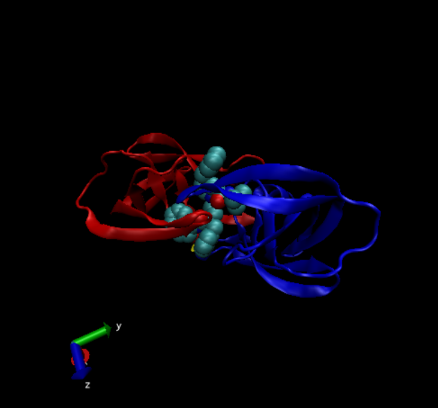
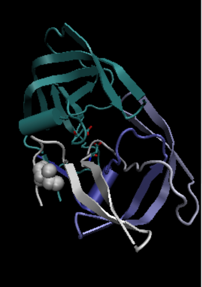
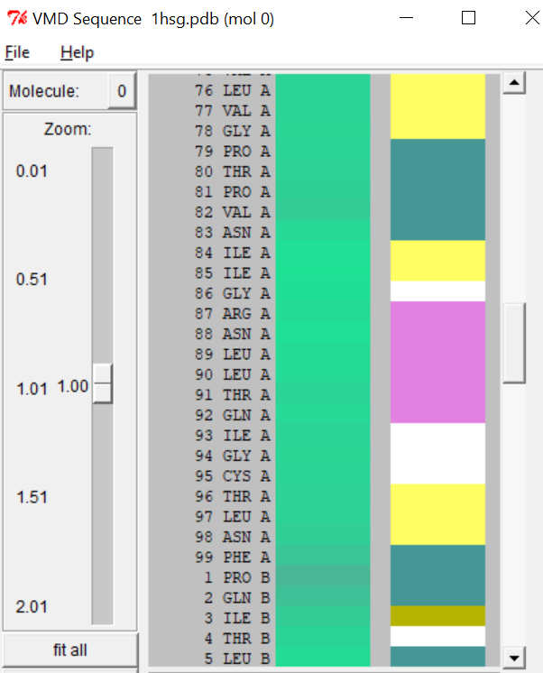
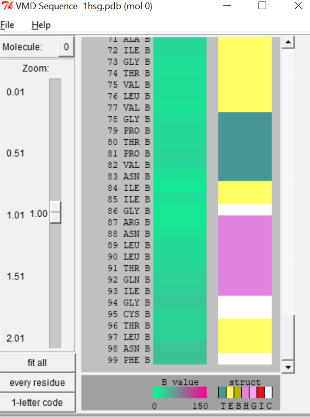

Lab11_git
================

``` r
db<-read.csv("Data Export SUmmary.csv",row.names=1)
head(db)
```

    ##                          X.ray   NMR   EM Multiple.methods Neutron Other  Total
    ## Protein (only)          142303 11804 5999              177      70    32 160385
    ## Protein/Oligosaccharide   8414    31  979                5       0     0   9429
    ## Protein/NA                7491   274 1986                3       0     0   9754
    ## Nucleic acid (only)       2368  1372   60                8       2     1   3811
    ## Other                      149    31    3                0       0     0    183
    ## Oligosaccharide (only)      11     6    0                1       0     4     22

> Q1: What percentage of structures in the PDB are solved by X-Ray and
> Electron Microscopy.

``` r
methodsums<-colSums(db)
round(methodsums/methodsums["Total"] *100,2)
```

    ##            X.ray              NMR               EM Multiple.methods 
    ##            87.55             7.36             4.92             0.11 
    ##          Neutron            Other            Total 
    ##             0.04             0.02           100.00

87.55% for X-rays, 4.92% of EMs

> Q2: What proportion of structures in the PDB are protein?

87.36%

``` r
round((db$Total/methodsums["Total"])*100,2)
```

    ## [1] 87.36  5.14  5.31  2.08  0.10  0.01

``` r
#typesums
```

The proteins take up 87.36% of the total structures included.

> Q3: Type HIV in the PDB website search box on the home page and
> determine how many HIV-1 protease structures are in the current PDB?

1828 structures

> Q4: Water molecules normally have 3 atoms. Why do we see just one atom
> per water molecule in this structure?

This is because the hydrogen is usually too small.

> Q5: There is a conserved water molecule in the binding site. Can you
> identify this water molecule? What residue number does this water
> molecule have (see note below)?

Residue 308.

## VMD structure visualization image



> Q6: As you have hopefully observed HIV protease is a homodimer
> (i.e. it is composed of two identical chains). With the aid of the
> graphic display and the sequence viewer extension can you identify
> secondary structure elements that are likely to only form in the dimer
> rather than the monomer?

Yes. As is shown on the pic, the unique element is the extension at
chain B residue 3, also some sequence elements are helix structures
involving residue 87-92.

  

#Using Bio3D

``` r
library(bio3d)

pdb<-read.pdb("1hsg")
```

    ##   Note: Accessing on-line PDB file

``` r
pdb
```

    ## 
    ##  Call:  read.pdb(file = "1hsg")
    ## 
    ##    Total Models#: 1
    ##      Total Atoms#: 1686,  XYZs#: 5058  Chains#: 2  (values: A B)
    ## 
    ##      Protein Atoms#: 1514  (residues/Calpha atoms#: 198)
    ##      Nucleic acid Atoms#: 0  (residues/phosphate atoms#: 0)
    ## 
    ##      Non-protein/nucleic Atoms#: 172  (residues: 128)
    ##      Non-protein/nucleic resid values: [ HOH (127), MK1 (1) ]
    ## 
    ##    Protein sequence:
    ##       PQITLWQRPLVTIKIGGQLKEALLDTGADDTVLEEMSLPGRWKPKMIGGIGGFIKVRQYD
    ##       QILIEICGHKAIGTVLVGPTPVNIIGRNLLTQIGCTLNFPQITLWQRPLVTIKIGGQLKE
    ##       ALLDTGADDTVLEEMSLPGRWKPKMIGGIGGFIKVRQYDQILIEICGHKAIGTVLVGPTP
    ##       VNIIGRNLLTQIGCTLNF
    ## 
    ## + attr: atom, xyz, seqres, helix, sheet,
    ##         calpha, remark, call

``` r
aa123(pdbseq(pdb))
```

    ##   [1] "PRO" "GLN" "ILE" "THR" "LEU" "TRP" "GLN" "ARG" "PRO" "LEU" "VAL" "THR"
    ##  [13] "ILE" "LYS" "ILE" "GLY" "GLY" "GLN" "LEU" "LYS" "GLU" "ALA" "LEU" "LEU"
    ##  [25] "ASP" "THR" "GLY" "ALA" "ASP" "ASP" "THR" "VAL" "LEU" "GLU" "GLU" "MET"
    ##  [37] "SER" "LEU" "PRO" "GLY" "ARG" "TRP" "LYS" "PRO" "LYS" "MET" "ILE" "GLY"
    ##  [49] "GLY" "ILE" "GLY" "GLY" "PHE" "ILE" "LYS" "VAL" "ARG" "GLN" "TYR" "ASP"
    ##  [61] "GLN" "ILE" "LEU" "ILE" "GLU" "ILE" "CYS" "GLY" "HIS" "LYS" "ALA" "ILE"
    ##  [73] "GLY" "THR" "VAL" "LEU" "VAL" "GLY" "PRO" "THR" "PRO" "VAL" "ASN" "ILE"
    ##  [85] "ILE" "GLY" "ARG" "ASN" "LEU" "LEU" "THR" "GLN" "ILE" "GLY" "CYS" "THR"
    ##  [97] "LEU" "ASN" "PHE" "PRO" "GLN" "ILE" "THR" "LEU" "TRP" "GLN" "ARG" "PRO"
    ## [109] "LEU" "VAL" "THR" "ILE" "LYS" "ILE" "GLY" "GLY" "GLN" "LEU" "LYS" "GLU"
    ## [121] "ALA" "LEU" "LEU" "ASP" "THR" "GLY" "ALA" "ASP" "ASP" "THR" "VAL" "LEU"
    ## [133] "GLU" "GLU" "MET" "SER" "LEU" "PRO" "GLY" "ARG" "TRP" "LYS" "PRO" "LYS"
    ## [145] "MET" "ILE" "GLY" "GLY" "ILE" "GLY" "GLY" "PHE" "ILE" "LYS" "VAL" "ARG"
    ## [157] "GLN" "TYR" "ASP" "GLN" "ILE" "LEU" "ILE" "GLU" "ILE" "CYS" "GLY" "HIS"
    ## [169] "LYS" "ALA" "ILE" "GLY" "THR" "VAL" "LEU" "VAL" "GLY" "PRO" "THR" "PRO"
    ## [181] "VAL" "ASN" "ILE" "ILE" "GLY" "ARG" "ASN" "LEU" "LEU" "THR" "GLN" "ILE"
    ## [193] "GLY" "CYS" "THR" "LEU" "ASN" "PHE"

``` r
attributes(pdb)
```

    ## $names
    ## [1] "atom"   "xyz"    "seqres" "helix"  "sheet"  "calpha" "remark" "call"  
    ## 
    ## $class
    ## [1] "pdb" "sse"

``` r
head(pdb$atom)
```

    ##   type eleno elety  alt resid chain resno insert      x      y     z o     b
    ## 1 ATOM     1     N <NA>   PRO     A     1   <NA> 29.361 39.686 5.862 1 38.10
    ## 2 ATOM     2    CA <NA>   PRO     A     1   <NA> 30.307 38.663 5.319 1 40.62
    ## 3 ATOM     3     C <NA>   PRO     A     1   <NA> 29.760 38.071 4.022 1 42.64
    ## 4 ATOM     4     O <NA>   PRO     A     1   <NA> 28.600 38.302 3.676 1 43.40
    ## 5 ATOM     5    CB <NA>   PRO     A     1   <NA> 30.508 37.541 6.342 1 37.87
    ## 6 ATOM     6    CG <NA>   PRO     A     1   <NA> 29.296 37.591 7.162 1 38.40
    ##   segid elesy charge
    ## 1  <NA>     N   <NA>
    ## 2  <NA>     C   <NA>
    ## 3  <NA>     C   <NA>
    ## 4  <NA>     O   <NA>
    ## 5  <NA>     C   <NA>
    ## 6  <NA>     C   <NA>

> Q7: How many amino acid residues are there in this pdb object?

198

> Q8: Name one of the two non-protein residues?

MK1

> Q9: How many protein chains are in this structure?

2

> Q10. Which of the packages above is found only on BioConductor and not
> CRAN?

msa

> Q11. Which of the above packages is not found on BioConductor or
> CRAN?:

bio3d-view

> Q12. True or False? Functions from the devtools package can be used to
> install packages from GitHub and BitBucket?

TRUE
