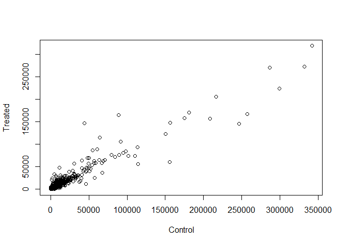

Lab15_git
================

The data for this lab report comes from a published RNA-seq experiment
where airway smooth muscle cells were treated with dexamethasone, a
synthetic glucocorticoid steroid with anti-inflammatory effects (Himes
et al. 2014).

Glucocorticoids are used, for example, by people with asthma to reduce
inflammation of the airways. The anti-inflammatory effects on airway
smooth muscle (ASM) cells has been known for some time but the
underlying molecular mechanisms are unclear.

Himes et al. used RNA-seq to profile gene expression changes in four
different ASM cell lines treated with dexamethasone glucocorticoid. They
found a number of differentially expressed genes comparing
dexamethasone-treated to control cells, but focus much of the discussion
on a gene called CRISPLD2. This gene encodes a secreted protein known to
be involved in lung development, and SNPs in this gene in previous GWAS
studies are associated with inhaled corticosteroid resistance and
bronchodilator response in asthma patients. They confirmed the
upregulated CRISPLD2 mRNA expression with qPCR and increased protein
expression using Western blotting.

In the experiment, four primary human ASM cell lines were treated with 1
mM dexamethasone for 18 hours. For each of the four cell lines, we have
a treated and an untreated sample. They did their analysis using Tophat
and Cufflinks similar to our last day’s hands-on session. For a more
detailed description of their analysis see the PubMed entry 24926665 and
for raw data see the GEO entry GSE52778.

In this lab session we will read and explore the gene expression data
from this experiment using R functions and then perform a detailed
analysis with the DESeq2 package from Bioconductor.

# 1. Bioconductor and data setup

``` r
#install.packages("BiocManager")
#BiocManager::install()
# For this class, you'll also need DESeq2:
#BiocManager::install("DESeq2")


library(BiocManager)
library(DESeq2)
```

    ## Loading required package: S4Vectors

    ## Loading required package: stats4

    ## Loading required package: BiocGenerics

    ## 
    ## Attaching package: 'BiocGenerics'

    ## The following objects are masked from 'package:stats':
    ## 
    ##     IQR, mad, sd, var, xtabs

    ## The following objects are masked from 'package:base':
    ## 
    ##     anyDuplicated, append, as.data.frame, basename, cbind, colnames,
    ##     dirname, do.call, duplicated, eval, evalq, Filter, Find, get, grep,
    ##     grepl, intersect, is.unsorted, lapply, Map, mapply, match, mget,
    ##     order, paste, pmax, pmax.int, pmin, pmin.int, Position, rank,
    ##     rbind, Reduce, rownames, sapply, setdiff, sort, table, tapply,
    ##     union, unique, unsplit, which.max, which.min

    ## 
    ## Attaching package: 'S4Vectors'

    ## The following objects are masked from 'package:base':
    ## 
    ##     expand.grid, I, unname

    ## Loading required package: IRanges

    ## 
    ## Attaching package: 'IRanges'

    ## The following object is masked from 'package:grDevices':
    ## 
    ##     windows

    ## Loading required package: GenomicRanges

    ## Loading required package: GenomeInfoDb

    ## Loading required package: SummarizedExperiment

    ## Loading required package: MatrixGenerics

    ## Loading required package: matrixStats

    ## 
    ## Attaching package: 'MatrixGenerics'

    ## The following objects are masked from 'package:matrixStats':
    ## 
    ##     colAlls, colAnyNAs, colAnys, colAvgsPerRowSet, colCollapse,
    ##     colCounts, colCummaxs, colCummins, colCumprods, colCumsums,
    ##     colDiffs, colIQRDiffs, colIQRs, colLogSumExps, colMadDiffs,
    ##     colMads, colMaxs, colMeans2, colMedians, colMins, colOrderStats,
    ##     colProds, colQuantiles, colRanges, colRanks, colSdDiffs, colSds,
    ##     colSums2, colTabulates, colVarDiffs, colVars, colWeightedMads,
    ##     colWeightedMeans, colWeightedMedians, colWeightedSds,
    ##     colWeightedVars, rowAlls, rowAnyNAs, rowAnys, rowAvgsPerColSet,
    ##     rowCollapse, rowCounts, rowCummaxs, rowCummins, rowCumprods,
    ##     rowCumsums, rowDiffs, rowIQRDiffs, rowIQRs, rowLogSumExps,
    ##     rowMadDiffs, rowMads, rowMaxs, rowMeans2, rowMedians, rowMins,
    ##     rowOrderStats, rowProds, rowQuantiles, rowRanges, rowRanks,
    ##     rowSdDiffs, rowSds, rowSums2, rowTabulates, rowVarDiffs, rowVars,
    ##     rowWeightedMads, rowWeightedMeans, rowWeightedMedians,
    ##     rowWeightedSds, rowWeightedVars

    ## Loading required package: Biobase

    ## Welcome to Bioconductor
    ## 
    ##     Vignettes contain introductory material; view with
    ##     'browseVignettes()'. To cite Bioconductor, see
    ##     'citation("Biobase")', and for packages 'citation("pkgname")'.

    ## 
    ## Attaching package: 'Biobase'

    ## The following object is masked from 'package:MatrixGenerics':
    ## 
    ##     rowMedians

    ## The following objects are masked from 'package:matrixStats':
    ## 
    ##     anyMissing, rowMedians

DESeq2 Required Inputs As input, the DESeq2 package expects (1) a
data.frame of count data (as obtained from RNA-seq or another
high-throughput sequencing experiment) and (2) a second data.frame with
information about the samples - often called sample metadata (or colData
in DESeq2-speak because it supplies metadata/information about the
columns of the countData matrix).

The “count matrix” (called the countData in DESeq2-speak) the value in
the i-th row and the j-th column of the data.frame tells us how many
reads can be assigned to gene i in sample j. Analogously, for other
types of assays, the rows of this matrix might correspond e.g. to
binding regions (with ChIP-Seq) or peptide sequences (with quantitative
mass spectrometry).

For the sample metadata (i.e. colData in DESeq2-speak) samples are in
rows and metadata about those samples are in columns. Notice that the
first column of colData must match the column names of countData (except
the first, which is the gene ID column).

# 2. Import countData and colData

``` r
#use the read.csv() function to read these count data and metadata files.

counts <- read.csv("airway_scaledcounts.csv", row.names=1)
metadata <-  read.csv("airway_metadata.csv")
```

``` r
head(counts)
```

    ##                 SRR1039508 SRR1039509 SRR1039512 SRR1039513 SRR1039516
    ## ENSG00000000003        723        486        904        445       1170
    ## ENSG00000000005          0          0          0          0          0
    ## ENSG00000000419        467        523        616        371        582
    ## ENSG00000000457        347        258        364        237        318
    ## ENSG00000000460         96         81         73         66        118
    ## ENSG00000000938          0          0          1          0          2
    ##                 SRR1039517 SRR1039520 SRR1039521
    ## ENSG00000000003       1097        806        604
    ## ENSG00000000005          0          0          0
    ## ENSG00000000419        781        417        509
    ## ENSG00000000457        447        330        324
    ## ENSG00000000460         94        102         74
    ## ENSG00000000938          0          0          0

``` r
head(metadata)
```

    ##           id     dex celltype     geo_id
    ## 1 SRR1039508 control   N61311 GSM1275862
    ## 2 SRR1039509 treated   N61311 GSM1275863
    ## 3 SRR1039512 control  N052611 GSM1275866
    ## 4 SRR1039513 treated  N052611 GSM1275867
    ## 5 SRR1039516 control  N080611 GSM1275870
    ## 6 SRR1039517 treated  N080611 GSM1275871

> Q1. How many genes are in this dataset? 38694

``` r
dim(counts)
```

    ## [1] 38694     8

> Q2. How many ‘control’ cell lines do we have? 4

``` r
sum(metadata$dex=="control")
```

    ## [1] 4

# 3. Differential gene expression

Lets perform some exploratory differential gene expression analysis.

Look at the metadata object again to see which samples are control and
which are drug treated.

First, need to extract all the control columns, then generate row-wise
mean to get the average count values for all gene in these 4
experiments.

Note that the control samples are SRR1039508, SRR1039512, SRR1039516,
and SRR1039520. This bit of code will first find the sample id for those
labeled control. Then calculate the mean counts per gene across these
samples:

``` r
control <- metadata[metadata[,"dex"]=="control",]
control.counts <- counts[ ,control$id]
control.mean <- rowSums( control.counts )/4 
#head(control.mean)
control.mean<-rowMeans(control.counts)
```

``` r
library(dplyr)
```

    ## 
    ## Attaching package: 'dplyr'

    ## The following object is masked from 'package:Biobase':
    ## 
    ##     combine

    ## The following object is masked from 'package:matrixStats':
    ## 
    ##     count

    ## The following objects are masked from 'package:GenomicRanges':
    ## 
    ##     intersect, setdiff, union

    ## The following object is masked from 'package:GenomeInfoDb':
    ## 
    ##     intersect

    ## The following objects are masked from 'package:IRanges':
    ## 
    ##     collapse, desc, intersect, setdiff, slice, union

    ## The following objects are masked from 'package:S4Vectors':
    ## 
    ##     first, intersect, rename, setdiff, setequal, union

    ## The following objects are masked from 'package:BiocGenerics':
    ## 
    ##     combine, intersect, setdiff, union

    ## The following objects are masked from 'package:stats':
    ## 
    ##     filter, lag

    ## The following objects are masked from 'package:base':
    ## 
    ##     intersect, setdiff, setequal, union

``` r
control <- metadata %>% filter(dex=="control")
control.counts <- counts %>% select(control$id) 
control.mean <- rowSums(control.counts)/4
#head(control.mean)
```

> Q3. How would you make the above code in either approach more robust?

By adding more control and treated samples in to the analysis.

> Q4. Follow the same procedure for the treated samples (i.e. calculate
> the mean per gene across drug treated samples and assign to a labeled
> vector called treated.mean)

``` r
treated <- metadata[,"dex"]=="treated"
treated.counts <- counts[,treated]
treated.mean <- rowMeans(treated.counts)
```

Combine the meancount data for bookkeeping purposes.

``` r
meancounts <- data.frame(control.mean, treated.mean)
colSums(meancounts)
```

    ## control.mean treated.mean 
    ##     23005324     22196524

> Q5 (a). Create a scatter plot showing the mean of the treated samples
> against the mean of the control samples.

``` r
plot(meancounts[,1],meancounts[,2], xlab="Control", ylab="Treated")
```

<!-- -->

> Q5 (b).Use the ggplot2 package to make this figure producing the plot
> below. What geom\_?( ) function would you use for this plot? The
> geom_point() layer is used.

``` r
library(ggplot2)
ggplot(meancounts)+
  aes(meancounts[,1],meancounts[,2])+
  labs(x="Control", y="Treated")+
  geom_point(alpha=0.4)
```

<!-- -->

We can find candidate differentially expressed genes by looking for
genes with a large change between control and dex-treated samples. We
usually look at the log2 of the fold change, because this has better
mathematical properties.

> Q6. Try plotting both axes on a log scale. What is the argument to
> plot() that allows you to do this?

The log argument.

``` r
plot(meancounts[,1],meancounts[,2], xlab="Control", ylab="Treated", log="xy")
```

    ## Warning in xy.coords(x, y, xlabel, ylabel, log): 15032 x values <= 0 omitted
    ## from logarithmic plot

    ## Warning in xy.coords(x, y, xlabel, ylabel, log): 15281 y values <= 0 omitted
    ## from logarithmic plot

<!-- -->

log 2 is often used in this field, because the interpretation would be
easier.

0 values for no change and + values for increases and minus values for
decreases. This nice property allows us to work with
**log2()fold_change**

Here we calculate log2foldchange, add it to our `meancounts` data.frame
and inspect the results either with the head() or the View() function
for example.

``` r
#make a new column to meancounts
meancounts$log2fc <- log2(meancounts[,"treated.mean"]/meancounts[,"control.mean"])
#head(meancounts)
```

``` r
head(meancounts[,1:2]==0)
```

    ##                 control.mean treated.mean
    ## ENSG00000000003        FALSE        FALSE
    ## ENSG00000000005         TRUE         TRUE
    ## ENSG00000000419        FALSE        FALSE
    ## ENSG00000000457        FALSE        FALSE
    ## ENSG00000000460        FALSE        FALSE
    ## ENSG00000000938        FALSE         TRUE

Use the **which** function with the `TRUE` argument to get the columns
and rows where true values are. (the zero counts!)

``` r
zero.vals <- which(meancounts[,1:2]==0, arr.ind=TRUE)

to.rm <- unique(zero.vals[,"row"])
#head(sort(to.rm))
#now remove the genes from meancounts dataframe

mycounts <- meancounts[-to.rm,]
#head(mycounts)
```

> Q7. What is the purpose of the arr.ind argument in the which()
> function call above? Why would we then take the first column of the
> output and need to call the unique() function? Answer: 1. arr.ind=TRUE
> argument will make which() to return both the row and column indices
> where there are TRUE values. In this case this will tell us which
> genes (rows) and samples (columns) have zero counts, so later on we
> can remove them. 2. unique() ensures that the rows are unique(because
> some rows and columns can have zeros at the same time and count twice)

The number of genes left? 21817

``` r
nrow(mycounts)
```

    ## [1] 21817

``` r
up.ind <- mycounts$log2fc > 2
down.ind <- mycounts$log2fc < (-2)
```

``` r
sum(up.ind)
```

    ## [1] 250

``` r
sum(down.ind)
```

    ## [1] 367

> Q8. Using the up.ind vector above can you determine how many up
> regulated genes we have at the greater than 2 fc level? 250

> Q9. Using the down.ind vector above can you determine how many down
> regulated genes we have at the greater than 2 fc level? 367

> Q10. Do you trust these results? Why or why not? NO. fold change can
> be large (e.g. >\>two-fold up- or down-regulation) without being
> statistically significant. We need to decide the statsitical
> significance of the gene reagulations.

# 4. DESeq 2 analysis

DESeq2 is an R package specifically for analyzing count-based NGS data
like RNA-seq. It is available from Bioconductor. Bioconductor is a
project to provide tools for analyzing high-throughput genomic data
including RNA-seq, ChIP-seq and arrays. You can explore Bioconductor
packages here.

Bioconductor packages usually have great documentation in the form of
vignettes.

``` r
library(DESeq2)
#citation("DESeq2")
```

Bioconductor software packages often define and use custom class objects
for storing data. This helps to ensure that all the needed data for
analysis (and the results) are available. DESeq works on a particular
type of object called a DESeqDataSet. The DESeqDataSet is a single
object that contains input values, intermediate calculations like how
things are normalized, and all results of a differential expression
analysis.

A DESeqDataSet can be constructed from from (1) a count matrix, (2) a
metadata file, and (3) a formula indicating the design of the
experiment.

1.  and (2) are covered previously. The third needed item that has to be
    specified at the beginning of the analysis is a design formula. This
    tells DESeq2 which columns in the sample information table (colData)
    specify the experimental design (i.e. which groups the samples
    belong to) and how these factors should be used in the analysis.
    Essentially, this formula expresses how the counts for each gene
    depend on the variables in colData.

Take a look at metadata again. The thing we’re interested in is the dex
column, which tells us which samples are treated with dexamethasone
versus which samples are untreated controls. We’ll specify the design
with a tilde, like this: design=\~dex. (The tilde is the shifted key to
the left of the number 1 key on my keyboard. It looks like a little
squiggly line).

We will use the DESeqDataSetFromMatrix() function to build the required
DESeqDataSet object and call it dds, short for our DESeqDataSet. If you
get a warning about “some variables in design formula are characters,
converting to factors” don’t worry about it. Take a look at the dds
object once you create it.

``` r
dds <- DESeqDataSetFromMatrix(countData=counts, 
                              colData=metadata, 
                              design=~dex)
```

    ## converting counts to integer mode

    ## Warning in DESeqDataSet(se, design = design, ignoreRank): some variables in
    ## design formula are characters, converting to factors

DESeq analysis Next, run the DESeq analysis pipeline on the dataset, and
reassign the resulting object back to the same variable. The DESeq()
function takes a DESeqDataSet and returns a DESeqDataSet, but with
additional information filled in (including the differential expression
results).

Running the DESeq pipeline on the `dds` object, and reassigning the
whole thing back to dds, which will now be a DESeqDataSet populated with
all those values. This function calls a number of other functions within
the package to essentially run the entire pipeline (normalizing by
library size by estimating the “size factors,” estimating dispersion for
the negative binomial model, and fitting models and getting statistics
for each gene for the design specified when importing the data).

``` r
dds <- DESeq(dds)
```

    ## estimating size factors

    ## estimating dispersions

    ## gene-wise dispersion estimates

    ## mean-dispersion relationship

    ## final dispersion estimates

    ## fitting model and testing

``` r
res <- results(dds)
```

#Save results: Write out the entire dataset, including genes that don’t
change significantly

``` r
write.csv(res,file="allmyresults.csv")
```

``` r
summary(res)
```

    ## 
    ## out of 25258 with nonzero total read count
    ## adjusted p-value < 0.1
    ## LFC > 0 (up)       : 1563, 6.2%
    ## LFC < 0 (down)     : 1188, 4.7%
    ## outliers [1]       : 142, 0.56%
    ## low counts [2]     : 9971, 39%
    ## (mean count < 10)
    ## [1] see 'cooksCutoff' argument of ?results
    ## [2] see 'independentFiltering' argument of ?results

The results function contains a number of arguments to customize the
results table. By default the argument alpha is set to 0.1. If the
adjusted p value cutoff will be a value other than 0.1, alpha should be
set to that value.

Focus on changes with a small p-value:

``` r
res05 <- results(dds, alpha=0.05)
summary(res05)
```

    ## 
    ## out of 25258 with nonzero total read count
    ## adjusted p-value < 0.05
    ## LFC > 0 (up)       : 1236, 4.9%
    ## LFC < 0 (down)     : 933, 3.7%
    ## outliers [1]       : 142, 0.56%
    ## low counts [2]     : 9033, 36%
    ## (mean count < 6)
    ## [1] see 'cooksCutoff' argument of ?results
    ## [2] see 'independentFiltering' argument of ?results

``` r
library("AnnotationDbi")
```

    ## 
    ## Attaching package: 'AnnotationDbi'

    ## The following object is masked from 'package:dplyr':
    ## 
    ##     select

``` r
#BiocManager::install("org.Hs.eg.db")
library("org.Hs.eg.db")
```

    ## 

# 5. Adding annotation data

Our result table so far only contains the Ensembl gene IDs. However,
alternative gene names and extra annotation are usually required for
informative interpretation of our results. In this section we will add
this necessary annotation data to our results.

We use one of Bioconductor’s main annotation packages to help with
mapping between various ID schemes. Here we load the AnnotationDbi
package and the annotation data package for humans org.Hs.eg.db.

``` r
res$symbol <- mapIds(org.Hs.eg.db,
                     keys=row.names(res), # Our genenames
                     keytype="ENSEMBL",        # The format of our genenames
                     column="SYMBOL",          # The new format we want to add
                     multiVals="first")
```

    ## 'select()' returned 1:many mapping between keys and columns

> Q11.Run the mapIds() function two more times to add the Entrez ID and
> UniProt accession and GENENAME as new columns called
> res*e**n**t**r**e**z*, *r**e**s*uniprot and res$genename.

``` r
res$entrez <- mapIds(org.Hs.eg.db,
                     keys=row.names(res),
                     column="ENTREZID",
                     keytype="ENSEMBL",
                     multiVals="first")
```

    ## 'select()' returned 1:many mapping between keys and columns

``` r
res$uniprot <- mapIds(org.Hs.eg.db,
                     keys=row.names(res),
                     column="UNIPROT",
                     keytype="ENSEMBL",
                     multiVals="first")
```

    ## 'select()' returned 1:many mapping between keys and columns

``` r
res$genename <- mapIds(org.Hs.eg.db,
                     keys=row.names(res),
                     column="GENENAME",
                     keytype="ENSEMBL",
                     multiVals="first")
```

    ## 'select()' returned 1:many mapping between keys and columns

``` r
#head(res)
```

``` r
ord <- order( res$padj )
#View(res[ord,])
head(res[ord,])
```

    ## log2 fold change (MLE): dex treated vs control 
    ## Wald test p-value: dex treated vs control 
    ## DataFrame with 6 rows and 10 columns
    ##                  baseMean log2FoldChange     lfcSE      stat      pvalue
    ##                 <numeric>      <numeric> <numeric> <numeric>   <numeric>
    ## ENSG00000152583   954.771        4.36836 0.2371268   18.4220 8.74490e-76
    ## ENSG00000179094   743.253        2.86389 0.1755693   16.3120 8.10784e-60
    ## ENSG00000116584  2277.913       -1.03470 0.0650984  -15.8944 6.92855e-57
    ## ENSG00000189221  2383.754        3.34154 0.2124058   15.7319 9.14433e-56
    ## ENSG00000120129  3440.704        2.96521 0.2036951   14.5571 5.26424e-48
    ## ENSG00000148175 13493.920        1.42717 0.1003890   14.2164 7.25128e-46
    ##                        padj      symbol      entrez     uniprot
    ##                   <numeric> <character> <character> <character>
    ## ENSG00000152583 1.32441e-71     SPARCL1        8404  A0A024RDE1
    ## ENSG00000179094 6.13966e-56        PER1        5187      O15534
    ## ENSG00000116584 3.49776e-53     ARHGEF2        9181      Q92974
    ## ENSG00000189221 3.46227e-52        MAOA        4128      P21397
    ## ENSG00000120129 1.59454e-44       DUSP1        1843      B4DU40
    ## ENSG00000148175 1.83034e-42        STOM        2040      F8VSL7
    ##                               genename
    ##                            <character>
    ## ENSG00000152583           SPARC like 1
    ## ENSG00000179094 period circadian reg..
    ## ENSG00000116584 Rho/Rac guanine nucl..
    ## ENSG00000189221    monoamine oxidase A
    ## ENSG00000120129 dual specificity pho..
    ## ENSG00000148175               stomatin

# 6. Volcano plots

Volcano plots are data visualization frequently used to highlight the
proportion of genes that are both significantly regulated and display a
high fold change.

``` r
plot(res$log2FoldChange, log(res$padj))
```

<!-- -->

We can flip the p-value axis by by changing the sign of y axis

``` r
plot( res$log2FoldChange,  -log(res$padj), 
      xlab="Log2(FoldChange)",
      ylab="-Log(P-value)")
```

<!-- -->

To make this more useful we can add some guidelines (with the abline()
function) and color (with a custom color vector) highlighting genes that
have padj\<0.05 and the absolute log2FoldChange>2.

``` r
plot( res$log2FoldChange,  -log(res$padj), 
 ylab="-Log(P-value)", xlab="Log2(FoldChange)")

# Add some cut-off lines
abline(v=c(-2,2), col="darkgray", lty=2)
abline(h=-log(0.05), col="darkgray", lty=2)
```

<!-- -->

To color the points we will setup a custom color vector indicating
transcripts with large fold change and significant differences between
conditions:

``` r
#Setup our custom point color vector 
#add color to the points
mycols <- rep("gray", nrow(res))
#make the points red whose fold change is greater than 2
mycols[ abs(res$log2FoldChange) > 2 ]  <- "red" 

inds <- (res$padj < 0.01) & (abs(res$log2FoldChange) > 2 )
mycols[ inds ] <- "blue"

# Volcano plot with custom colors 
plot( res$log2FoldChange,  -log(res$padj), 
 col=mycols, ylab="-Log(P-value)", xlab="Log2(FoldChange)" )

# Cut-off lines
abline(v=c(-2,2), col="gray", lty=2)
abline(h=-log(0.1), col="gray", lty=2)
```

<!-- -->

Let’s make another volcano plot **Enhanced Volcano** biopackage:

``` r
library(EnhancedVolcano)
```

    ## Loading required package: ggrepel

    ## Registered S3 methods overwritten by 'ggalt':
    ##   method                  from   
    ##   grid.draw.absoluteGrob  ggplot2
    ##   grobHeight.absoluteGrob ggplot2
    ##   grobWidth.absoluteGrob  ggplot2
    ##   grobX.absoluteGrob      ggplot2
    ##   grobY.absoluteGrob      ggplot2

``` r
x <- as.data.frame(res)

EnhancedVolcano(x,
    lab = x$symbol,
    x = 'log2FoldChange',
    y = 'pvalue')
```

<!-- -->
