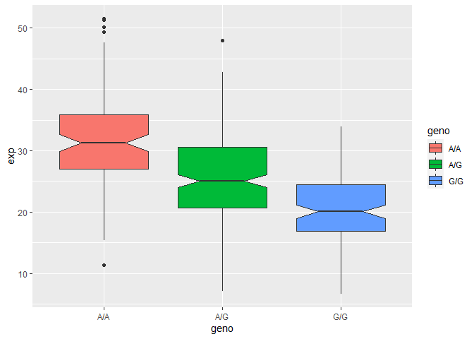

Class19_git
================

> Q1 4 candidate SNPs (rs12936231, rs8067378, rs9303277, and rs7216389)

> Q2 ZPBP2, GSDMB, and ORMDL3

> Q3 Location is: Chromosome 17:39895095; the different alleles are
> A/C/G Q4 ZPBP2, ORMDL3, LRRC3C Q5 MXL: G\|G takes up 14.06% Q6 The
> genotype is G\|G. taking up 30% population genotype

> Q7 3863 Q8 54% GC content, sequence length is 50-75

> Q9 The per base quality is very high, there’s no mean quality score
> below 20.

> Q10 PSMD3 and ORMDL3

> Q11 IKZF3, GSDMB and ORMDL3.

> Q12: Cufflinks again produces multiple output files that you can
> inspect from your right-handside galaxy history. From the “gene
> expression” output, what is the FPKM for the ORMDL3 gene? What are the
> other genes with above zero FPKM values? The FPKM for ORMDL3 is
> 128189. Others: ZPBP2, GSDMB, GSDMA, PSMD3

Here we read in te csv file

``` r
mxl <-read.csv("373531-SampleGenotypes-Homo_sapiens_Variation_Sample_rs8067378.csv")
```

``` r
table(mxl$Genotype..forward.strand.)
```

    ## 
    ## A|A A|G G|A G|G 
    ##  22  21  12   9

``` r
(table(mxl$Genotype..forward.strand.)/nrow(mxl))*100
```

    ## 
    ##     A|A     A|G     G|A     G|G 
    ## 34.3750 32.8125 18.7500 14.0625

``` r
GBR<-read.csv("373522-SampleGenotypes-Homo_sapiens_Variation_Sample_rs8067378.csv")
```

Find proportion of G\|G

``` r
round(100* table(GBR$Genotype..forward.strand.)/nrow(GBR))
```

    ## 
    ## A|A A|G G|A G|G 
    ##  25  19  26  30

This variant that’s associated with childhood asthma is more frequent in
the GBR population than the MXL

How many samples do we have??

``` r
expr<- read.table("genes.txt")
```

> Q13: Read this file into R and determine the sample size for each
> genotype and their corresponding median expression levels for each of
> these genotypes. Hint: The read.table(), summary() and boxplot()
> functions will likely be useful here. There is an example R script
> online to be used ONLY if you are struggling in vein. Note that you
> can find the medium value from saving the output of the boxplot()
> function to an R object and examining this object. There is also the
> medium() and summary() function that you can use to check your
> understanding.

A/A A/G G/G 108 233 121

A/A 31.24847  
A/G 25.06486  
G/G 20.07363

``` r
nrow(expr)
```

    ## [1] 462

``` r
table(expr$geno)
```

    ## 
    ## A/A A/G G/G 
    ## 108 233 121

``` r
#table(expr$exp)

gene<-read.table("genes.txt")
aggregate(expr$exp,         # Median by group
          list(expr$geno),
          median)
```

    ##   Group.1        x
    ## 1     A/A 31.24847
    ## 2     A/G 25.06486
    ## 3     G/G 20.07363

``` r
#summary(gene)
```

``` r
library(ggplot2)
ggplot(expr)+
  aes(x=geno,y=exp,fill=geno)+
  geom_boxplot(notch=TRUE)
```

<!-- -->

> Q14: Generate a boxplot with a box per genotype, what could you infer
> from the relative expression value between A/A and G/G displayed in
> this plot? Does the SNP effect the expression of ORMDL3?

A/A expression values are generally higher than G/G expression values.
The SNPs affect teh expression of ORMDL3.
