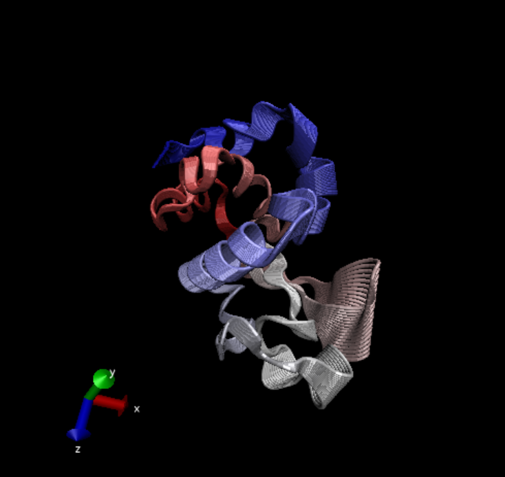
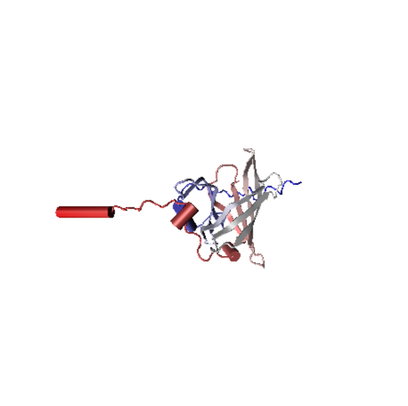

```{r}
library(bio3d)
#1hel or 1hsg
pdb<- read.pdb("1hsg")
pdb
```
>Q7: How many amino acid residues are there in this pdb object? 

198

>Q8: Name one of the two non-protein residues? 

MK1


>Q9: How many protein chains are in this structure? 

2


Let's use Bioinformatics methods called NMA(normal model analysis) to predict the dynamics(flexibility) of this enzyme


```{r}
pdb<-read.pdb("1hel")
modes<-nma(pdb)
plot(modes)


```

Make a move of the predicted motion called "trajectory"

```{r}
mktrj(modes, file="nma.pdb")
```



>Q10. Which of the packages is found only on BioConductor and not CRAN? 

msa

>Q11. Which of the packages is not found on BioConductor or CRAN?: 

bio3d-view


>Q12. True or False? Functions from the devtools package can be used to install packages from GitHub and BitBucket? 

TRUE

#Analysis of ADK

```{r}
library(bio3d)
aa <- get.seq("1ake_A")
```
```{r}
aa
```

>Q13. How many amino acids are in this sequence, i.e. how long is this sequence?

214 amino acids

```{r}
#blast<-blast.pdb(aa)

```


```{r}
#hits<-plot(blast)
#hits$pdb.id
```

```{r}
hits <- NULL
hits$pdb.id <- c('1AKE_A','4X8M_A','6S36_A','6RZE_A','4X8H_A','3HPR_A','1E4V_A','5EJE_A','1E4Y_A','3X2S_A','6HAP_A','6HAM_A','4K46_A','4NP6_A','3GMT_A','4PZL_A')

files <- get.pdb(hits$pdb.id, path="pdbs", split=TRUE, gzip=TRUE)

```

##Align and superpose structures
```{r}
#install.packages("ggrepel")
#install.packages("devtools")
#install.packages("BiocManager")

#BiocManager::install("msa")
#devtools::install_bitbucket("Grantlab/bio3d-view")
pdbs <- pdbaln(files, fit = TRUE, exefile="msa")
# Vector containing PDB codes for figure axis
pdbs
ids <- basename.pdb(pdbs$id)

# Draw schematic alignment
plot(pdbs, labels=ids)

```
```{r}
library(bio3d.view)
#install.packages("rgl")
library(rgl)

view.pdbs(pdbs)
```


##PCA analysis

```{r}
# Perform PCA
pc.xray <- pca(pdbs)
plot(pc.xray)
```
```{r}
# Calculate RMSD
rd <- rmsd(pdbs)

# Structure-based clustering
hc.rd <- hclust(dist(rd))
grps.rd <- cutree(hc.rd, k=3)

plot(pc.xray, 1:2, col="grey50", bg=grps.rd, pch=21, cex=1)
```

#Further visualization

```{r}
# Visualize first principal component
pc1 <- mktrj(pc.xray, pc=1, file="pc_1.pdb")
```


```{r}
view.xyz(pc1)
```
```{r}
view.xyz(pc1, col=vec2color( rmsf(pc1) ))

```

```{r}
#Plotting results with ggplot2
library(ggplot2)
library(ggrepel)

df <- data.frame(PC1=pc.xray$z[,1], 
                 PC2=pc.xray$z[,2], 
                 col=as.factor(grps.rd),
                 ids=ids)

p <- ggplot(df) + 
  aes(PC1, PC2, col=col, label=ids) +
  geom_point(size=2) +
  geom_text_repel(max.overlaps = 20) +
  theme(legend.position = "none")
p

```

#Normal Mode analysis
```{r}
# NMA of all structures
modes <- nma(pdbs)
plot(modes, pdbs, col=grps.rd)

```
>Q14. What do you note about this plot? Are the black and colored lines similar or different? Where do you think they differ most and why?

The black and colored lines are different, that the colored lines tend to fluctuate more and the differ most at residue number 50 and 150. Those are the hinge portions of the ligand binding parts of the protein, which have the most specificity and differences.


The one below is the png for the "Find a gene project"



