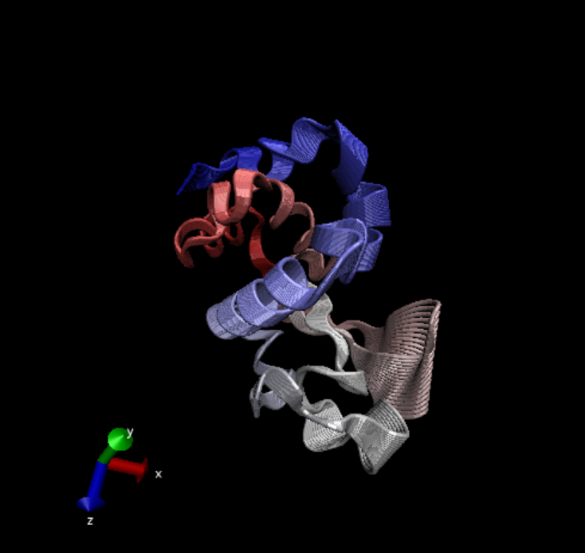

```{r}
library(bio3d)
#1hel or 1hsg
pdb<- read.pdb("1hsg")
pdb
```
>Q7: How many amino acid residues are there in this pdb object? 

198

>Q8: Name one of the two non-protein residues? 

MK1


>Q9: How many protein chains are in this structure? 

2


Let's use Bioinformatics methods called NMA(normal model analysis) to predict the dynamics(flexibility) of this enzyme


```{r}
pdb<-read.pdb("1hel")
modes<-nma(pdb)
plot(modes)


```

Make a move of the predicted motion called "trajectory"

```{r}
mktrj(modes, file="nma.pdb")
```



>Q10. Which of the packages is found only on BioConductor and not CRAN? 

msa

>Q11. Which of the packages is not found on BioConductor or CRAN?: 

bio3d-view


>Q12. True or False? Functions from the devtools package can be used to install packages from GitHub and BitBucket? 

TRUE

#Analysis of ADK

```{r}
library(bio3d)
aa <- get.seq("1ake_A")
```
```{r}
aa
```

>Q13. How many amino acids are in this sequence, i.e. how long is this sequence?

214 amino acids

```{r}
#blast<-blast.pdb(aa)

```


```{r}
#hits<-plot(blast)
#hits$pdb.id
```


```{r}
hits <- NULL
hits$pdb.id <- c('1AKE_A','4X8M_A','6S36_A','6RZE_A','4X8H_A','3HPR_A','1E4V_A','5EJE_A','1E4Y_A','3X2S_A','6HAP_A','6HAM_A','4K46_A','4NP6_A','3GMT_A','4PZL_A')

files <- get.pdb(hits$pdb.id, path="pdbs", split=TRUE, gzip=TRUE)

```

##Align and superpose structures
```{r}
#install.packages("ggrepel")
#install.packages("devtools")
#install.packages("BiocManager")

#BiocManager::install("msa")
#devtools::install_bitbucket("Grantlab/bio3d-view")
pdbs <- pdbaln(files, fit = TRUE, exefile="msa")
# Vector containing PDB codes for figure axis
pdbs
ids <- basename.pdb(pdbs$id)

# Draw schematic alignment
plot(pdbs, labels=ids)

```