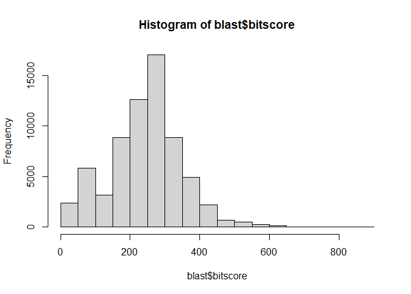
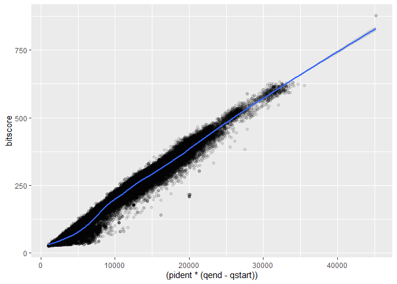

Class13_git
================

``` r
blast<-read.delim("mm-second.x.zebrafish.tsv")
colnames(blast) <-c("qseqid", "sseqid", "pident", "length", "mismatch", "gapopen", "qstart", "qend", "sstart", "send", "evalue", "bitscore")

hist(blast$bitscore)
```

<!-- -->

``` r
#install.packages("ggplot2")
library(ggplot2)
ggplot(blast)+
  aes((pident*(qend-qstart)),bitscore)+
  geom_point(alpha=0.1)+
  geom_smooth()
```

    ## `geom_smooth()` using method = 'gam' and formula 'y ~ s(x, bs = "cs")'

<!-- -->
