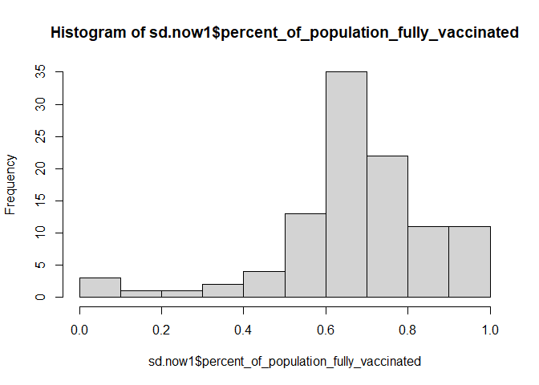
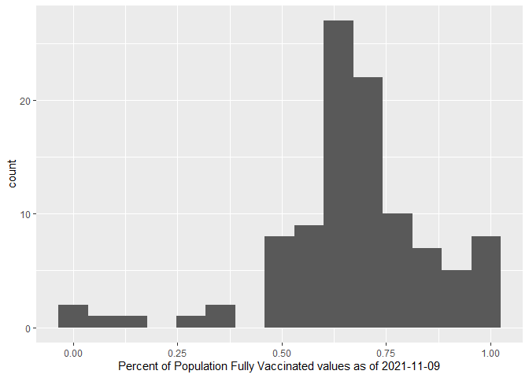
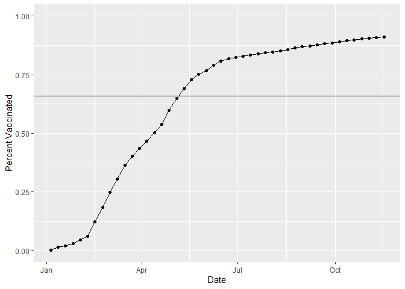
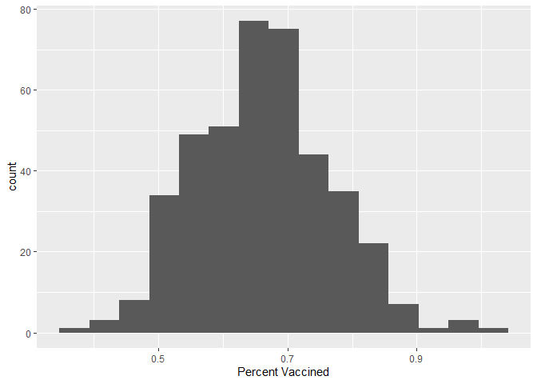
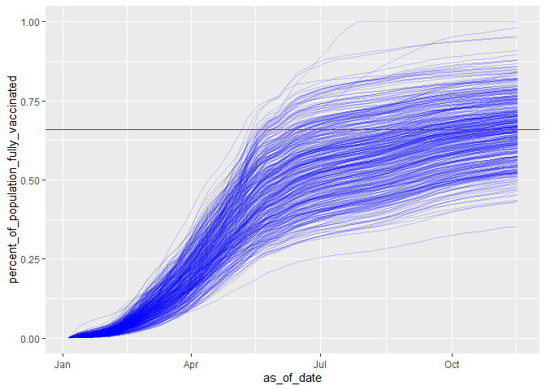

Lab17_git
================

#Background Vaccination rates across the states would be important
guides for us thru our holiday travels.

``` r
# Import vaccination data
vax <- read.csv( "covid19vaccinesbyzipcode_test.csv" )
head(vax)
```

    ##   as_of_date zip_code_tabulation_area local_health_jurisdiction    county
    ## 1 2021-01-05                    92804                    Orange    Orange
    ## 2 2021-01-05                    92626                    Orange    Orange
    ## 3 2021-01-05                    92250                  Imperial  Imperial
    ## 4 2021-01-05                    92637                    Orange    Orange
    ## 5 2021-01-05                    92155                 San Diego San Diego
    ## 6 2021-01-05                    92259                  Imperial  Imperial
    ##   vaccine_equity_metric_quartile                 vem_source
    ## 1                              2 Healthy Places Index Score
    ## 2                              3 Healthy Places Index Score
    ## 3                              1 Healthy Places Index Score
    ## 4                              3 Healthy Places Index Score
    ## 5                             NA            No VEM Assigned
    ## 6                              1    CDPH-Derived ZCTA Score
    ##   age12_plus_population age5_plus_population persons_fully_vaccinated
    ## 1               76455.9                84200                       19
    ## 2               44238.8                47883                       NA
    ## 3                7098.5                 8026                       NA
    ## 4               16027.4                16053                       NA
    ## 5                 456.0                  456                       NA
    ## 6                 119.0                  121                       NA
    ##   persons_partially_vaccinated percent_of_population_fully_vaccinated
    ## 1                         1282                               0.000226
    ## 2                           NA                                     NA
    ## 3                           NA                                     NA
    ## 4                           NA                                     NA
    ## 5                           NA                                     NA
    ## 6                           NA                                     NA
    ##   percent_of_population_partially_vaccinated
    ## 1                                   0.015226
    ## 2                                         NA
    ## 3                                         NA
    ## 4                                         NA
    ## 5                                         NA
    ## 6                                         NA
    ##   percent_of_population_with_1_plus_dose
    ## 1                               0.015452
    ## 2                                     NA
    ## 3                                     NA
    ## 4                                     NA
    ## 5                                     NA
    ## 6                                     NA
    ##                                                                redacted
    ## 1                                                                    No
    ## 2 Information redacted in accordance with CA state privacy requirements
    ## 3 Information redacted in accordance with CA state privacy requirements
    ## 4 Information redacted in accordance with CA state privacy requirements
    ## 5 Information redacted in accordance with CA state privacy requirements
    ## 6 Information redacted in accordance with CA state privacy requirements

#Ensure the usefulness of columns

`Lubridate` package to make file easier to read and process

``` r
library(lubridate)
```

    ## 
    ## Attaching package: 'lubridate'

    ## The following objects are masked from 'package:base':
    ## 
    ##     date, intersect, setdiff, union

``` r
today()
```

    ## [1] "2021-12-05"

#Quick look at the data structure

> Q1. What column details the total number of people fully vaccinated?
> persons_fully_vaccinated

> Q2. What column details the Zip code tabulation area?
> zip_code_tabulation_area

> Q3. What is the earliest date in this dataset? 2021-01-05

``` r
head(vax$as_of_date)
```

    ## [1] "2021-01-05" "2021-01-05" "2021-01-05" "2021-01-05" "2021-01-05"
    ## [6] "2021-01-05"

> Q4. What is the latest date in this dataset? 2021-11-16

``` r
tail(vax$as_of_date)
```

    ## [1] "2021-11-16" "2021-11-16" "2021-11-16" "2021-11-16" "2021-11-16"
    ## [6] "2021-11-16"

``` r
skimr::skim(vax)
```

|                                                  |       |
|:-------------------------------------------------|:------|
| Name                                             | vax   |
| Number of rows                                   | 81144 |
| Number of columns                                | 14    |
| \_\_\_\_\_\_\_\_\_\_\_\_\_\_\_\_\_\_\_\_\_\_\_   |       |
| Column type frequency:                           |       |
| character                                        | 5     |
| numeric                                          | 9     |
| \_\_\_\_\_\_\_\_\_\_\_\_\_\_\_\_\_\_\_\_\_\_\_\_ |       |
| Group variables                                  | None  |

Data summary

**Variable type: character**

| skim_variable             | n_missing | complete_rate | min | max | empty | n_unique | whitespace |
|:--------------------------|----------:|--------------:|----:|----:|------:|---------:|-----------:|
| as_of_date                |         0 |             1 |  10 |  10 |     0 |       46 |          0 |
| local_health_jurisdiction |         0 |             1 |   0 |  15 |   230 |       62 |          0 |
| county                    |         0 |             1 |   0 |  15 |   230 |       59 |          0 |
| vem_source                |         0 |             1 |  15 |  26 |     0 |        3 |          0 |
| redacted                  |         0 |             1 |   2 |  69 |     0 |        2 |          0 |

**Variable type: numeric**

| skim_variable                              | n_missing | complete_rate |     mean |       sd |    p0 |      p25 |      p50 |      p75 |     p100 | hist  |
|:-------------------------------------------|----------:|--------------:|---------:|---------:|------:|---------:|---------:|---------:|---------:|:------|
| zip_code_tabulation_area                   |         0 |          1.00 | 93665.11 |  1817.39 | 90001 | 92257.75 | 93658.50 | 95380.50 |  97635.0 | ▃▅▅▇▁ |
| vaccine_equity_metric_quartile             |      4002 |          0.95 |     2.44 |     1.11 |     1 |     1.00 |     2.00 |     3.00 |      4.0 | ▇▇▁▇▇ |
| age12_plus_population                      |         0 |          1.00 | 18895.04 | 18993.94 |     0 |  1346.95 | 13685.10 | 31756.12 |  88556.7 | ▇▃▂▁▁ |
| age5_plus_population                       |         0 |          1.00 | 20875.24 | 21106.05 |     0 |  1460.50 | 15364.00 | 34877.00 | 101902.0 | ▇▃▂▁▁ |
| persons_fully_vaccinated                   |      8256 |          0.90 |  9456.49 | 11498.25 |    11 |   506.00 |  4105.00 | 15859.00 |  71078.0 | ▇▂▁▁▁ |
| persons_partially_vaccinated               |      8256 |          0.90 |  1900.61 |  2113.07 |    11 |   200.00 |  1271.00 |  2893.00 |  20185.0 | ▇▁▁▁▁ |
| percent_of_population_fully_vaccinated     |      8256 |          0.90 |     0.42 |     0.27 |     0 |     0.19 |     0.44 |     0.62 |      1.0 | ▇▆▇▆▂ |
| percent_of_population_partially_vaccinated |      8256 |          0.90 |     0.10 |     0.10 |     0 |     0.06 |     0.07 |     0.11 |      1.0 | ▇▁▁▁▁ |
| percent_of_population_with_1\_plus_dose    |      8256 |          0.90 |     0.50 |     0.26 |     0 |     0.30 |     0.53 |     0.70 |      1.0 | ▅▅▇▇▃ |

> Q5. How many numeric columns are in this dataset? 9

> Q6. Note that there are “missing values” in the dataset. How many NA
> values there in the persons_fully_vaccinated column? 8256

``` r
sum( is.na(vax$persons_fully_vaccinated) )
```

    ## [1] 8256

> Q7. What percent of persons_fully_vaccinated values are missing (to 2
> significant figures)? 10.17%

``` r
sum<-sum( is.na(vax$persons_fully_vaccinated))
  100*sum/length(vax$persons_fully_vaccinated)
```

    ## [1] 10.1745

``` r
# Speciffy that we are using the Year-mont-day format
vax$as_of_date <- ymd(vax$as_of_date)
today() - vax$as_of_date[1]
```

    ## Time difference of 334 days

``` r
vax$as_of_date[nrow(vax)] - vax$as_of_date[1]
```

    ## Time difference of 315 days

``` r
today()-vax$as_of_date[nrow(vax)]
```

    ## Time difference of 19 days

> Q9. How many days have passed since the last update of the dataset? 6

> Q10. How many unique dates are in the dataset (i.e. how many different
> dates are detailed)? 46

``` r
length(unique(vax$as_of_date))
```

    ## [1] 46

#Working with ZIP codes One of the numeric columns in the dataset
(namely vax$zip_code_tabulation_area) are actually ZIP codes - a postal
code used by the United States Postal Service (USPS). In R we can use
the zipcodeR package to make working with these codes easier. For
example, let’s install and then load up this package and to find the
centroid of the La Jolla 92037 (i.e. UC San Diego) ZIP code area.

``` r
#install.packages("zipcodeR")
library(zipcodeR)
```

    ## Warning: package 'zipcodeR' was built under R version 4.1.2

``` r
geocode_zip('92037')
```

    ## # A tibble: 1 x 3
    ##   zipcode   lat   lng
    ##   <chr>   <dbl> <dbl>
    ## 1 92037    32.8 -117.

``` r
zip_distance('92037','92109')
```

    ##   zipcode_a zipcode_b distance
    ## 1     92037     92109     2.33

``` r
reverse_zipcode(c('92037', "92109") )
```

    ## # A tibble: 2 x 24
    ##   zipcode zipcode_type major_city post_office_city common_city_list county state
    ##   <chr>   <chr>        <chr>      <chr>                      <blob> <chr>  <chr>
    ## 1 92037   Standard     La Jolla   La Jolla, CA           <raw 20 B> San D~ CA   
    ## 2 92109   Standard     San Diego  San Diego, CA          <raw 21 B> San D~ CA   
    ## # ... with 17 more variables: lat <dbl>, lng <dbl>, timezone <chr>,
    ## #   radius_in_miles <dbl>, area_code_list <blob>, population <int>,
    ## #   population_density <dbl>, land_area_in_sqmi <dbl>,
    ## #   water_area_in_sqmi <dbl>, housing_units <int>,
    ## #   occupied_housing_units <int>, median_home_value <int>,
    ## #   median_household_income <int>, bounds_west <dbl>, bounds_east <dbl>,
    ## #   bounds_north <dbl>, bounds_south <dbl>

``` r
# Pull data for all ZIP codes in the dataset
zipdata <- reverse_zipcode( vax$zip_code_tabulation_area )
```

``` r
# Subset to San Diego county only areas
inds <-(vax$county=="San Diego")

#use dplyr package and filter function

library(dplyr)
```

    ## 
    ## Attaching package: 'dplyr'

    ## The following objects are masked from 'package:stats':
    ## 
    ##     filter, lag

    ## The following objects are masked from 'package:base':
    ## 
    ##     intersect, setdiff, setequal, union

``` r
sd <- filter(vax, county == "San Diego")
```

How many entries there are for San Diego County??

> Q11. How many distinct zip codes are listed for San Diego County? 107

``` r
length(unique(sd$zip_code_tabulation_area))
```

    ## [1] 107

> Q12. What San Diego County Zip code area has the largest 12 +
> Population in this dataset? 92154

``` r
sd.10 <- filter(vax, county == "San Diego" &
                age5_plus_population > 10000)
```

``` r
sd.12 <- filter(vax, county=="San Diego")
ind <-which.max(sd.12$age12_plus_population)
sd[ind,]
```

    ##    as_of_date zip_code_tabulation_area local_health_jurisdiction    county
    ## 23 2021-01-05                    92154                 San Diego San Diego
    ##    vaccine_equity_metric_quartile                 vem_source
    ## 23                              2 Healthy Places Index Score
    ##    age12_plus_population age5_plus_population persons_fully_vaccinated
    ## 23               76365.2                82971                       32
    ##    persons_partially_vaccinated percent_of_population_fully_vaccinated
    ## 23                         1336                               0.000386
    ##    percent_of_population_partially_vaccinated
    ## 23                                   0.016102
    ##    percent_of_population_with_1_plus_dose redacted
    ## 23                               0.016488       No

What is the population in the 92037 area?

``` r
filter(sd,zip_code_tabulation_area=="92037")[1,]
```

    ##   as_of_date zip_code_tabulation_area local_health_jurisdiction    county
    ## 1 2021-01-05                    92037                 San Diego San Diego
    ##   vaccine_equity_metric_quartile                 vem_source
    ## 1                              4 Healthy Places Index Score
    ##   age12_plus_population age5_plus_population persons_fully_vaccinated
    ## 1               33675.6                36144                       44
    ##   persons_partially_vaccinated percent_of_population_fully_vaccinated
    ## 1                         1265                               0.001217
    ##   percent_of_population_partially_vaccinated
    ## 1                                   0.034999
    ##   percent_of_population_with_1_plus_dose redacted
    ## 1                               0.036216       No

Using dplyr select all San Diego “county” entries on “as_of_date”
“2021-11-16” and use this for the following questions.

> Q13. What is the overall average “Percent of Population Fully
> Vaccinated” value for all San Diego “County” as of “2021-11-09”? 0.67

``` r
sd.now1 <- filter(vax, county == "San Diego" &
                as_of_date=="2021-11-09")
mean(sd.now1$percent_of_population_fully_vaccinated, na.rm=TRUE)
```

    ## [1] 0.6727567

``` r
summary(sd.now1$percent_of_population_fully_vaccinated)
```

    ##    Min. 1st Qu.  Median    Mean 3rd Qu.    Max.    NA's 
    ## 0.01017 0.60776 0.67700 0.67276 0.76164 1.00000       4

> Q14. Using either ggplot or base R graphics make a summary figure that
> shows the distribution of Percent of Population Fully Vaccinated
> values as of “2021-11-09”?

1.  Base R hist function

``` r
hist(sd.now1$percent_of_population_fully_vaccinated)
```

<!-- --> 2. Using
ggplot

``` r
library(ggplot2)

ggplot(sd.now1)+
  aes(percent_of_population_fully_vaccinated)+
  labs(x="Percent of Population Fully Vaccinated values as of 2021-11-09", y="count")+
  geom_histogram(bins=15)
```

    ## Warning: Removed 4 rows containing non-finite values (stat_bin).

<!-- -->

``` r
#"Percent of Population Fully Vaccinated values as of 2021-11-09"
```

What about 92037 - UCSD/La Jolla?

``` r
ucsd<-filter(sd, zip_code_tabulation_area=="92037")
```

``` r
ucsd[1,]$age5_plus_population
```

    ## [1] 36144

> Q15. Using ggplot make a graph of the vaccination rate time course for
> the 92037 ZIP code area:

``` r
ggplot(ucsd) +
  aes(as_of_date,percent_of_population_fully_vaccinated) +
  geom_point() +
  geom_line(group=1) +
  ylim(c(0,1)) +
  labs("Vaccination rate for La Jolla 92037",x="Date", y="Percent Vaccinated")+
  geom_hline(yintercept=0.66)
```

<!-- -->

#Comparing 92037 to other similar sized areas? Let’s return to the full
dataset and look across every zip code area with a population at least
as large as that of 92037 on as_of_date “2021-11-16”.

``` r
# Subset to all CA areas with a population as large as 92037
vax.36 <- filter(vax, age5_plus_population > 36144 &
                as_of_date == "2021-11-16")

#head(vax.36)
```

> Q16. Calculate the mean “Percent of Population Fully Vaccinated” for
> ZIP code areas with a population as large as 92037 (La Jolla)
> as_of_date “2021-11-16”. Add this as a straight horizontal line to
> your plot from above with the geom_hline() function? The mean is
> 0.6629812.

``` r
mean(vax.36$percent_of_population_fully_vaccinated)
```

    ## [1] 0.6629812

``` r
ggplot(ucsd) +
  aes(as_of_date,percent_of_population_fully_vaccinated) +
  geom_point() +
  geom_line(group=1) +
  ylim(c(0,1)) +
  labs("Vaccination rate for La Jolla 92037",x="Date", y="Percent Vaccinated")+
  geom_hline(yintercept=0.66)
```

<!-- -->

> Q17. What is the 6 number summary (Min, 1st Qu., Median, Mean, 3rd
> Qu., and Max) of the “Percent of Population Fully Vaccinated” values
> for ZIP code areas with a population as large as 92037 (La Jolla)
> as_of_date “2021-11-16”? Min. 1st Qu. Median Mean 3rd Qu. Max. 0.3519
> 0.5891 0.6649 0.6630 0.7286 1.0000

``` r
summary((vax.36$percent_of_population_fully_vaccinated))
```

    ##    Min. 1st Qu.  Median    Mean 3rd Qu.    Max. 
    ##  0.3519  0.5891  0.6649  0.6630  0.7286  1.0000

> Q18. Using ggplot generate a histogram of this data.

``` r
ggplot(vax.36)+
  aes(percent_of_population_fully_vaccinated)+
  labs(x="Percent Vaccined", y="count")+
  geom_histogram(bins=15)
```

<!-- --> \>Q19. Is
the 92109 and 92040 ZIP code areas above or below the average value you
calculated for all these above? The 92109 area is above the average
value, while the 92040 is below the averga value.

``` r
vax %>% filter(as_of_date == "2021-11-16") %>%  
  filter(zip_code_tabulation_area=="92040") %>%
  select(percent_of_population_fully_vaccinated)
```

    ##   percent_of_population_fully_vaccinated
    ## 1                               0.520463

``` r
vax %>% filter(as_of_date == "2021-11-16") %>%  
  filter(zip_code_tabulation_area=="92109") %>%
  select(percent_of_population_fully_vaccinated)
```

    ##   percent_of_population_fully_vaccinated
    ## 1                               0.687763

population in 92037 area:

``` r
ucsd[1,]$age5_plus_population
```

    ## [1] 36144

First, need to subset the full vax dataset to include only zip code
areas with a population as large as 92037

``` r
vax.36.all<- filter(vax,age5_plus_population>36144)
```

``` r
length(unique(vax.36.all$zip_code_tabluation_area))
```

    ## [1] 0

``` r
#mean(sd1$percent_of_population_fully_vaccinated, na.rm=TRUE)
```

> Q20. Finally make a time course plot of vaccination progress for all
> areas in the full dataset with a age5_plus_population \> 36144.

``` r
ggplot(vax.36.all)+
aes(as_of_date, percent_of_population_fully_vaccinated,
    group=zip_code_tabulation_area)+
  geom_line(alpha=0.2,col="blue")+
  geom_hline(yintercept=0.66, col="red")
```

    ## Warning: Removed 180 row(s) containing missing values (geom_path).

<!-- -->

> Q21. How do you feel about traveling for Thanksgiving and meeting for
> in-person class next Week? I feel it’s necessary to wear masks and
> keep social distancing, as a large number of people still haven’t got
> vaccinated.
